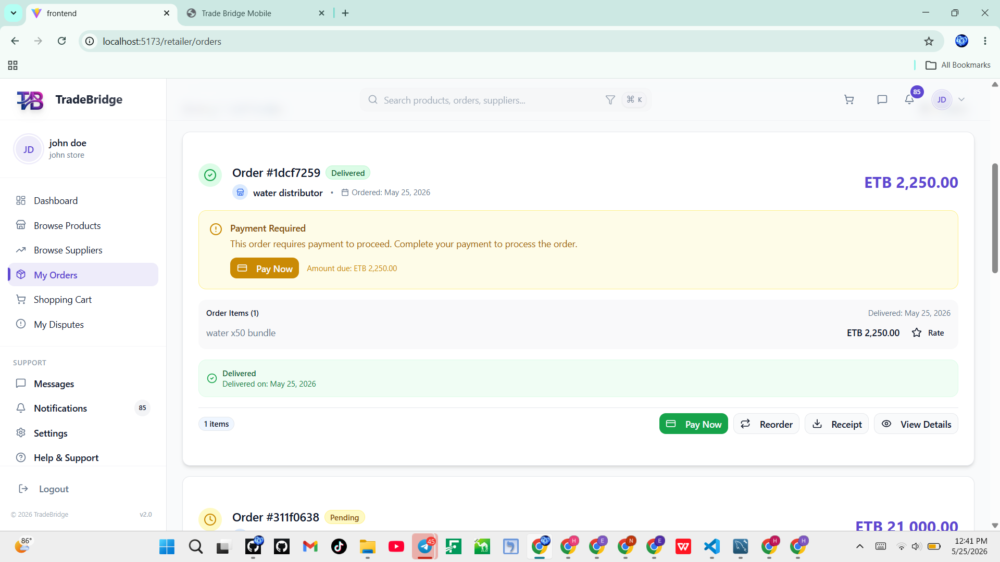
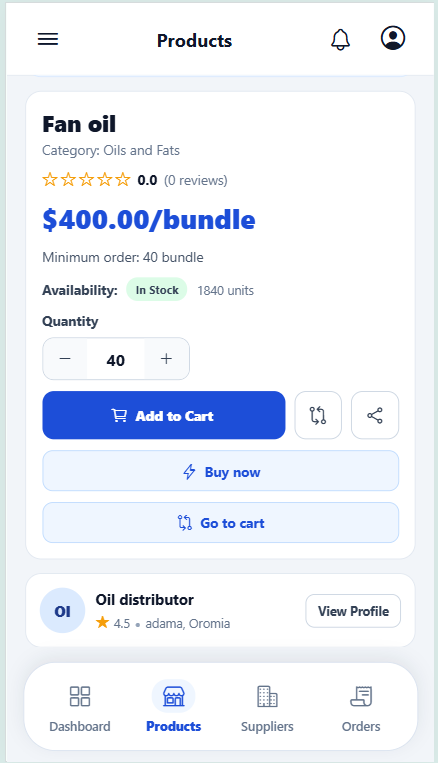
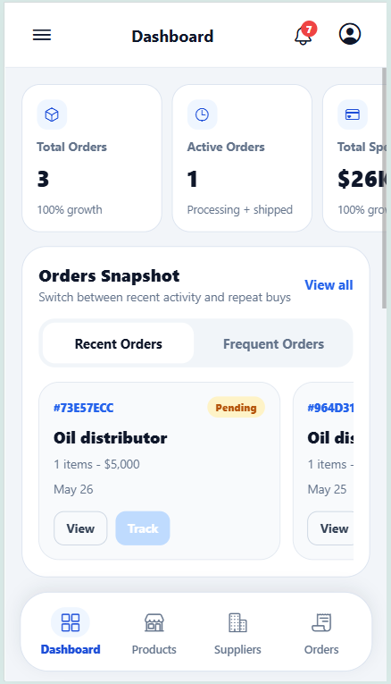

# TradeBridge

TradeBridge is a comprehensive, full-stack B2B trading platform that connects retailers and suppliers. The system comprises a backend API server, a web client, a mobile client, and a machine learning module for demand forecasting and smart supplier recommendations.

## Repository Layout

```text
trade_bridge/
├── backend/       # Node.js + Express + TypeScript API server
├── frontend/      # React + Vite + Tailwind CSS web application
├── mobile/        # Expo + React Native mobile application
└── ml/            # Python + FastAPI machine learning service
```

## Screenshots / App Preview

### Web Application (Frontend)
| Web Dashboard | Orders Management |
| :---: | :---: |
|  |  |

### Mobile Application
| product detail| Retailer Dashboard |
| :---: | :---: |
|  |  |

---

## Technical Stack

| Component | Technology / Framework | Key Features |
| :--- | :--- | :--- |
| **Backend** | Node.js, Express, TypeScript, Sequelize ORM, MySQL | JWT Auth, Chapa Payment Integration, Cloudinary Media Storage |
| **Frontend** | React, TypeScript, Vite, Tailwind CSS, Zustand | Interactive seller/buyer dashboards, Order flow, BNPL setup |
| **Mobile** | React Native, Expo, Expo Router, Zustand | Mobile dashboard, offline caching, native maps/location |
| **Machine Learning** | Python, FastAPI, Scikit-learn, Uvicorn | Demand forecasting (Time Series), Supplier Recommendations (Olist dataset) |

---

## Prerequisites

- **Node.js**: v18 or newer
- **npm**: v9 or newer
- **MySQL**: Running instance (v8.0 recommended)
- **Python**: v3.9 or newer (for ML services)

---

## Getting Started

### 1. Database Setup
The backend uses MySQL managed via Sequelize.
1. Create a MySQL database named `trade_bridge`.
2. Configure the database connection in `backend/.env` (see environment variables below).
3. To initialize, reset, and seed the database, run:
   ```bash
   cd backend
   # Reset database schemas and re-run all seeders (includes mock data)
   npm run db:refresh
   ```
   *Alternative scripts:*
   - `npm run db:reset`: Drops all tables and syncs schema.
   - `npm run db:seed`: Seeds the database with default images and files uploaded to Cloudinary.
   - `npm run db:seed:dev`: Seeds the database but skips Cloudinary uploads (faster local development).
   - `npm run db:seed:no-truncate`: Adds seed data without clearing existing table records.

### 2. Backend API
1. Navigate to the backend directory:
   ```bash
   cd backend
   ```
2. Install dependencies:
   ```bash
   npm install
   ```
3. Copy/create a `.env` file (refer to the **Environment Variables** section below).
4. Run the API in development mode with automatic reload:
   ```bash
   npm run dev
   ```
   *The API will start by default at `http://localhost:5000`.*
   *Verify health check at:* `GET http://localhost:5000/api/health`

### 3. Frontend Web App
1. Navigate to the frontend directory:
   ```bash
   cd frontend
   ```
2. Install dependencies:
   ```bash
   npm install
   ```
3. Copy/create a `.env` file with `VITE_API_URL`.
4. Start the Vite development server:
   ```bash
   npm run dev
   ```
5. Open `http://localhost:5173` in your browser.
6. Build for production:
   ```bash
   npm run build
   ```

### 4. Mobile App (Expo)
1. Navigate to the mobile directory:
   ```bash
   cd mobile
   ```
2. Install dependencies:
   ```bash
   npm install
   ```
3. Start the Expo development server:
   ```bash
   npm run start
   ```
4. Press `a` for Android Emulator, `i` for iOS Simulator, or scan the QR code using the Expo Go app.

### 5. Machine Learning Service (ML)
The ML service provides demand forecasting and smart supplier matching. It runs on Python using FastAPI.

#### Setup & Training Flow:
1. Navigate to the ML directory and set up a virtual environment:
   ```bash
   cd ml
   python -m venv venv
   # On Windows:
   .\venv\Scripts\activate
   # On macOS/Linux:
   source venv/bin/activate
   ```
2. Install Python dependencies:
   ```bash
   python -m pip install -r requirements.txt
   ```
3. Place raw Olist dataset CSV files inside `ml/data/raw/`.
4. Load and validate raw data:
   ```bash
   python load_data.py
   ```
5. Preprocess the Olist data:
   ```bash
   python preprocess.py
   ```
6. Build demand and recommendation features:
   ```bash
   python -m src.features.build_demand_features
   python -m src.features.build_recommendation_features
   ```
7. Train the models:
   ```bash
   python -m src.models.train_forecast
   python -m src.models.train_recommendation
   ```
8. **Export TradeBridge snapshot**:
   To align recommendation models (trained on Olist data) with live TradeBridge distributors, export a read-only snapshot of the active application database:
   ```bash
   cd backend
   npm run ml:export
   ```
   This generates `ml/data/processed/tradebridge_snapshot.json`. The ML API utilizes this snapshot to project active TradeBridge distributors into the trained Olist feature space, filters recommendations to active distributors, and resolves recommendations to real TradeBridge distributor IDs instead of Olist placeholder IDs.

9. Start the ML API server:
   ```bash
   cd ml
   uvicorn src.api.app:app --reload --port 8000
   ```

#### ML CLI Predictions (Optional):
For quick CLI tests, you can run:
```bash
# Get supplier recommendations
python predict.py recommend-supplier --top-k 5 --retailer-id <tradebridge_retailer_id> --product-id <tradebridge_product_id>

# Forecast product demand
python predict.py forecast-demand --product-id <product_id> --horizon-days 7
```

---

## Environment Variables

### Backend (`backend/.env`)

```env
# Server Configuration
PORT=5000
NODE_ENV=development
FRONTEND_URL=http://localhost:5173
BACKEND_URL=http://localhost:5000

# Database Configuration
DB_HOST=localhost
DB_PORT=3306
DB_USER=root
DB_PASSWORD=root
DB_NAME=trade_bridge
DB_SSL=true

# Redis Configuration (Optional / Caching)
REDIS_HOST=localhost
REDIS_PORT=6379
REDIS_PASSWORD=

# Security & JWT
JWT_SECRET=7ccb3b287f555093d86a9d47e6f093e84f1a5a5a10f6bf8c56b8192d635f533de968698cfa28941db49dc0b0484cfc1c29a76d62ba9c950a3139912ab33ab212
JWT_EXPIRES_IN=7d

# Media Storage (Cloudinary)
CLOUDINARY_CLOUD_NAME=dayjl9ogj
CLOUDINARY_API_KEY=444433731322691
CLOUDINARY_API_SECRET=-P7kxHrnpEk16PS_aQVaTLvLeqw

# Payment Integration (Chapa)
CHAPA_SECRET_KEY=CHASECK_TEST-xenTTutGFZh4KpqJxRW7XJJ0eermkVns
CHAPA_BASE_URL=https://api.chapa.co/v1
CHAPA_CURRENCY=ETB
CHAPA_CALLBACK_URL=http://localhost:5000/api/payments/chapa/callback
CHAPA_RETURN_URL=http://localhost:5173/retailer/orders

# Email Notification Server (SMTP)
SMTP_HOST=smtp.gmail.com
SMTP_PORT=587
SMTP_SECURE=false
SMTP_USER=your-email@gmail.com
SMTP_PASSWORD=your-app-password
SMTP_FROM=noreply@tradebridge.com
```

### Frontend (`frontend/.env`)

```env
VITE_API_URL=http://localhost:5000/api
```

---

## ML API Service Endpoints

### `POST /recommend-supplier`
Retrieves distributor recommendations matching a retailer and product context.

- **Request Body:**
  ```json
  {
    "top_k": 5,
    "retailer_id": "tradebridge_retailer_id",
    "product_id": "tradebridge_product_id",
    "product_category_name": "food"
  }
  ```
- **Response Shape:**
  ```json
  {
    "recommendations": [
      {
        "seller_id": "tradebridge_distributor_id",
        "name": "Distributor Business",
        "recommendation_score": 0.93
      }
    ],
    "meta": {
      "source": "tradebridge_snapshot",
      "personalization": { "retailer_id": true, "product_id": true },
      "scoring": { "strategy": "ml_bridge", "cold_start_rows": 0, "ml_rows": 12 }
    }
  }
  ```

### `POST /forecast-demand`
Retrieves product demand forecasts.

- **Request Body:**
  ```json
  {
    "product_id": "123",
    "seller_id": "abc",
    "horizon_days": 7
  }
  ```
